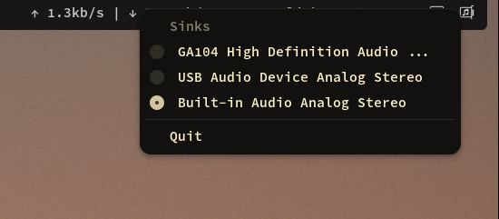

Simple audio output switcher applet for Linux. _(because I do not use a DE)_



## Installation

```bash
go install github.com/ony-boom/swoosh@latest
```

**With nix**:
Using the package from the flake:

```nix
# In your flake.nix
{
  inputs.swoosh.url = "github:ony-boom/swoosh";
  # optional, if you want to use the same nixpkgs as your flake
  inputs.swoosh.inputs.nixpkgs.follows = "nixpkgs";
}

# somewhere in your packages if nixos
{
  environment.systemPackages = with pkgs; [
    inputs.swoosh.packages.${pkgs.system}.swoosh
  ];
}

# or in your home-manager configuration
{
  home.packages = with pkgs; [
    inputs.swoosh.packages.${pkgs.system}.swoosh
  ];
```

Or you can install directly like this:

```bash
# if newer version of nix
nix profile add github:ony-boom/swoosh
# or with older version
nix profile install github:ony-boom/swoosh
```

## Usage

Just run `swoosh` in your terminal or autostart it in your window manager.

### Autostart with systemd (Recommended)

To avoid startup issues where swoosh starts before PulseAudio is ready, you can use the provided systemd service:

1. Copy the service file to your user systemd directory:

```bash
mkdir -p ~/.config/systemd/user
# copy the service file or download it from the repo
cp assets/swoosh.service ~/.config/systemd/user/
```

2. Update the ExecStart path in the service file to match your installation:

```bash
# If installed with go install
sed -i 's|%h/.local/bin/swoosh|%h/go/bin/swoosh|' ~/.config/systemd/user/swoosh.service

# If installed with nix
sed -i 's|%h/.local/bin/swoosh|/usr/bin/env swoosh|' ~/.config/systemd/user/swoosh.service
```

3. Enable and start the service:

```bash
systemctl --user enable swoosh.service
systemctl --user start swoosh.service
```

### Manual startup

If you prefer to start swoosh manually or from your window manager, you can set a startup delay to ensure services are ready:

```bash
# Wait 5 seconds before starting
SWOOSH_STARTUP_DELAY=5 swoosh
```

## Troubleshooting

**Application crashes on startup:**

- Make sure your audio server (PulseAudio or PipeWire) is running
- Try with a startup delay: `SWOOSH_STARTUP_DELAY=5 swoosh`
- Use the systemd service for proper dependency ordering

## Configuration

Swoosh automatically creates a configuration file at `~/.config/swoosh/config.json` (or `$XDG_CONFIG_HOME/swoosh/config.json` if the environment variable is set) on first run.

The configuration file supports the following options:

### Available Options

- **`hideSink`** (array of strings): List of sink IDs to hide from the menu
- **`pollIntervalSeconds`** (integer): How often to check for audio changes in seconds (default: 2)

### Example Configuration

```json
{
  "hideSink": ["alsa_output.pci-0000_00_1f.3.analog-stereo"],
  "pollIntervalSeconds": 5
}
```

### Configuration Details

- All configuration options are optional - missing options will use default values
- Changes to the configuration file require restarting swoosh to take effect
- The config file is created with default values on first run for easy editing
- Invalid configuration files will fall back to default settings with error logging

**Roadmap:**

- [ ] List available audio inputs (sources)
- [x] Allow simple configuration (e.g. polling interval, hide source, ...)
- [ ] Better way to detect signal changes (currently polling) or using a different tray library that allow rerendering every time the menu is opened
- [ ] Log to a file instead of stdout

**Alternatives:**

- [pasystray](https://github.com/christophgysin/pasystray)
- [indicator-sound-switcher](https://github.com/yktoo/indicator-sound-switcher)
